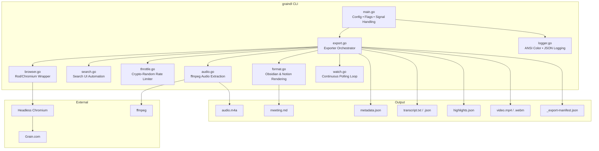

<p align="center">
  <strong>graindl</strong><br/>
  Export your meetings, transcripts, highlights, and videos from <a href="https://grain.com">Grain</a> &mdash; on your terms.
</p>

<p align="center">
  <a href="https://github.com/droxey/graindl/actions"></a>
  <a href="https://goreportcard.com/report/github.com/droxey/graindl"></a>
  
  <a href="LICENSE"></a>
  
</p>

---

## Table of Contents

- [Why graindl?](#why-graindl)
- [Who Is This For?](#who-is-this-for)
- [Features](#features)
- [Architecture](#architecture)
- [Installation](#installation)
- [Quick Start](#quick-start)
- [Usage](#usage)
  - [Flags & Environment Variables](#flags--environment-variables)
  - [Search Filtering](#search-filtering)
  - [Audio-Only Export](#audio-only-export)
  - [Watch Mode](#watch-mode)
  - [Output Formats (Obsidian / Notion)](#output-formats-obsidian--notion)
- [Output Structure](#output-structure)
- [Docker](#docker)
- [Development](#development)
- [Security](#security)
- [License](#license)

---

## Why graindl?

[Grain](https://grain.com) records, transcribes, and highlights your meetings. It's great for capturing knowledge in the moment &mdash; but that knowledge lives on Grain's servers, in Grain's UI, on Grain's schedule.

**graindl** gives you a local, portable copy of everything: metadata, transcripts, highlights, AI notes, and video files. It was written because:

- **Your meetings are your data.** If you switch tools, cancel a subscription, or just want offline access, you shouldn't lose years of institutional knowledge.
- **Second brains need raw material.** Tools like Obsidian and Notion are powerful &mdash; but only if the content actually gets there. graindl bridges the gap with native Obsidian and Notion export formats, complete with YAML frontmatter.
- **Automation beats clicking.** Manually downloading dozens (or hundreds) of meetings from a web UI is tedious and error-prone. graindl handles discovery, pagination, rate-limiting, and retries so you don't have to.
- **Browser automation was the only way.** Grain doesn't offer a public bulk-export API. graindl uses headless Chromium (via [Rod](https://github.com/nicedoc/rod)) to navigate the Grain interface the same way you would &mdash; just faster and without the carpal tunnel.

It's a single static binary with one dependency (`go-rod/rod`). No Node.js runtime, no Python virtualenv, no config files to maintain.

## Who Is This For?

- **Teams leaving Grain** who need a complete archive before their subscription ends
- **Knowledge workers** who pipe meeting notes into Obsidian, Notion, or other PKM tools
- **Ops/IT teams** who want automated, scheduled exports running in Docker
- **Researchers** who need meeting transcripts in machine-readable JSON for analysis
- **Anyone** who believes their meeting data should exist somewhere they control

## Features

| | |
|---|---|
| **Full meeting export** | Metadata, transcripts (plain text + structured JSON), highlights, AI notes, video |
| **Search filtering** | `--search "Q4 planning"` exports only matching meetings via Grain's search UI |
| **Audio extraction** | `--audio-only` pulls just the audio track via ffmpeg &mdash; great for re-transcription with Whisper |
| **Obsidian & Notion export** | `--output-format obsidian` or `notion` generates markdown with YAML frontmatter |
| **Watch mode** | `--watch` polls continuously for new meetings on an interval, like a cron job that never forgets |
| **Headless or interactive** | Run with a visible browser for debugging, or headless for servers and CI |
| **Docker-ready** | Multi-stage Alpine image, runs as non-root, resource-limited by default |
| **Rate-limited** | Crypto-random delays between requests to be respectful to Grain's servers |
| **Security-first** | `0o600` file perms, input sanitization, no secrets in process args, path traversal protection |

## Architecture



**Data flow:** `main()` parses config and hands off to the `Exporter`, which discovers meetings via the `Browser` (Rod + Chromium), optionally filters by search query, then exports each meeting's page data (metadata, transcript, highlights) into structured files. Videos are downloaded via multiple fallback strategies. Watch mode wraps the whole pipeline in a polling loop with healthcheck support.

## Installation

### From source (recommended)

Requires **Go 1.23+**.

```bash
git clone https://github.com/droxey/graindl.git
cd graindl
make build
```

This produces a static binary (`./graindl`) with the git version and commit hash baked in.

### Via `go install`

```bash
go install github.com/droxey/graindl@latest
```

### Docker

```bash
docker build -t graindl .
# or with version tags:
make docker
```

See [Docker](#docker) below for full usage.

### Prerequisites

- **Chromium** &mdash; Rod downloads it automatically on first run, or use the system-installed version
- **ffmpeg** &mdash; only required for `--audio-only` mode

## Quick Start

```bash
# 1. Build
make build

# 2. Create a .env file with your credentials
cat > .env << 'EOF'
GRAIN_HEADLESS=true
GRAIN_OUTPUT_DIR=./recordings
EOF

# 3. Run (opens a browser for Grain login on first use)
./graindl

# 4. Or export a specific meeting by ID
./graindl --id abc123def456
```

On the first run, graindl opens a Chromium window so you can log in to Grain. Your session is saved to `.grain-session/` and reused on subsequent runs. Use `--headless` once you have a valid session.

## Usage

```
graindl [flags]
```

### Flags & Environment Variables

| Flag | Env Var | Default | Description |
|---|---|---|---|
| `--output` | `GRAIN_OUTPUT_DIR` | `./recordings` | Output directory for exported meetings |
| `--session-dir` | `GRAIN_SESSION_DIR` | `./.grain-session` | Browser profile directory (session persistence) |
| `--max` | `GRAIN_MAX_MEETINGS` | `0` (all) | Max number of meetings to export |
| `--id` | `GRAIN_MEETING_ID` | | Export a single meeting by its Grain ID |
| `--search` | `GRAIN_SEARCH` | | Search query to filter meetings |
| `--skip-video` | `GRAIN_SKIP_VIDEO` | `false` | Skip video downloads (metadata + transcript only) |
| `--audio-only` | `GRAIN_AUDIO_ONLY` | `false` | Extract audio track only (requires ffmpeg) |
| `--overwrite` | `GRAIN_OVERWRITE` | `false` | Re-export meetings that already exist locally |
| `--headless` | `GRAIN_HEADLESS` | `false` | Run Chromium in headless mode |
| `--clean-session` | | `false` | Wipe browser session before run |
| `--parallel` | `GRAIN_PARALLEL` | `1` | Concurrent meeting exports (file I/O only; browser ops are serialized) |
| `--output-format` | `GRAIN_OUTPUT_FORMAT` | | Export format: `obsidian` or `notion` |
| `--watch` | `GRAIN_WATCH` | `false` | Continuous polling mode |
| `--interval` | `GRAIN_WATCH_INTERVAL` | `30m` | Polling interval for watch mode (e.g., `5m`, `1h`) |
| `--healthcheck-file` | `GRAIN_HEALTHCHECK_FILE` | | File to touch after each watch cycle (monitoring) |
| `--min-delay` | `GRAIN_MIN_DELAY` | `2.0` | Min throttle delay in seconds |
| `--max-delay` | `GRAIN_MAX_DELAY` | `6.0` | Max throttle delay in seconds |
| `--dry-run` | `GRAIN_DRY_RUN` | `false` | List meetings without exporting |
| `--log-format` | `GRAIN_LOG_FORMAT` | `color` | Log format: `color` (default) or `json` |
| `--verbose` | `GRAIN_VERBOSE` | `false` | Debug-level logging |
| `--version` | | | Print version and exit |

**Config priority:** CLI flags > environment variables > `.env` file > defaults.

### Search Filtering

Export only meetings that match a query:

```bash
./graindl --search "Q4 planning"
```

This navigates Grain's search UI in the browser, scrolls through all results, extracts matching meeting IDs, then exports only those. Combine with `--max` to cap output:

```bash
./graindl --search "weekly standup" --max 10
```

### Audio-Only Export

Extract just the audio track from each meeting &mdash; useful for re-transcription with Whisper, archiving, or saving bandwidth:

```bash
./graindl --audio-only
```

Requires [ffmpeg](https://ffmpeg.org/) on your PATH. The tool first tries to stream audio directly from the source URL (no full video download), then falls back to downloading the video and extracting locally. Output is `.m4a` (AAC at 192kbps). Intermediate video files are cleaned up automatically.

```bash
# Audio for a specific meeting
./graindl --audio-only --id abc123

# Audio for search results
./graindl --audio-only --search "Q4 planning"
```

### Watch Mode

Run graindl as a long-lived process that polls for new meetings on an interval. Already-exported meetings are automatically skipped:

```bash
./graindl --watch --interval 1h --headless
```

Features:
- Reuses the browser session across cycles (no repeated logins)
- Writes a healthcheck file after each cycle for external monitoring (`--healthcheck-file`)
- Graceful shutdown on `Ctrl-C` / `SIGTERM`
- JSON logging available for log aggregation (`--log-format json`)

```bash
# Watch with healthcheck and JSON logs (ideal for Docker)
./graindl --watch --interval 30m --headless \
  --healthcheck-file /tmp/graindl-health \
  --log-format json
```

### Output Formats (Obsidian / Notion)

Generate markdown files with YAML frontmatter tailored for your knowledge management tool:

```bash
# Obsidian-style: frontmatter with tags, aliases, participants, links
./graindl --output-format obsidian

# Notion-style: frontmatter with type, status, summary callout block
./graindl --output-format notion
```

Each exported meeting gets a `.md` file alongside the standard JSON/text output. The markdown includes AI notes, highlights, and the full transcript &mdash; ready to drop into your vault or workspace.

## Output Structure

Each meeting is exported into a date-prefixed directory:

```
recordings/
  2024-11-15/
    Q4-Planning-Review/
      metadata.json          # Full meeting metadata (participants, duration, links, AI notes)
      transcript.txt         # Plain text transcript
      transcript.json        # Structured transcript with timestamps
      highlights.json        # Normalized highlight clips
      meeting.md             # Formatted markdown (if --output-format is set)
      video.mp4              # Meeting recording (unless --skip-video)
      audio.m4a              # Audio track (if --audio-only)
  2024-11-16/
    Weekly-Standup/
      ...
  _export-manifest.json      # Summary: totals, statuses, paths for all exported meetings
```

The manifest (`_export-manifest.json`) provides a machine-readable summary of each export run with counts of successful, skipped, errored, and HLS-pending meetings.

## Docker

The Docker image uses a multi-stage build: `golang:1.23-alpine` compiles a static binary, then `alpine:3.20` provides the runtime with Chromium, ffmpeg, and a non-root `exporter` user.

### Docker Compose (recommended)

```yaml
# docker-compose.yml is included in the repo
services:
  graindl:
    build: .
    restart: unless-stopped
    volumes:
      - ./recordings:/data
      - ./.env:/home/exporter/.env:ro
    deploy:
      resources:
        limits:
          memory: 2G
          cpus: '1.0'
```

```bash
docker compose up
```

Recordings persist on the host via the `./recordings` volume mount. The `.env` file is mounted read-only.

### Watch mode in Docker

Override the default command:

```bash
docker compose run graindl \
  --output /data --headless --watch --interval 30m --log-format json
```

### Manual Docker run

```bash
docker run --rm \
  -v $(pwd)/recordings:/data \
  -v $(pwd)/.env:/home/exporter/.env:ro \
  graindl:latest --output /data --headless --skip-video
```

## Development

```bash
make build     # Build static binary with git version/commit via ldflags
make test      # Run tests with race detector (go test -count=1 -race ./...)
make vet       # Run go vet
make lint      # Run golangci-lint (graceful skip if not installed)
make verify    # Verify module dependency integrity
make clean     # Remove binary
make docker    # Build Docker image tagged with git version
```

### Running tests

```bash
# Standard
make test

# Verbose
go test -v -count=1 ./...
```

The test suite uses Go's `testing` package with `httptest` servers for HTTP mocking. Tests verify both functional behavior and security properties (file permissions, path handling, input sanitization, URL encoding).

### Project layout

All source lives in the root as a single `main` package &mdash; flat, simple, no internal packages to navigate:

```
main.go       CLI entry, flag parsing, .env loading, signal handling
models.go     Type definitions (Config, MeetingRef, ExportResult, Metadata, Highlight)
export.go     Exporter orchestrator: discovery, per-meeting export, manifest
browser.go    Rod/Chromium wrapper: login, discovery, scraping, video download
search.go     Browser-based search: navigates Grain search UI, extracts results
logger.go     Custom slog.Handler with ANSI color output (JSON via --log-format)
throttle.go   Crypto-random rate limiter for polite request spacing
audio.go      Audio extraction via ffmpeg (--audio-only mode)
format.go     Markdown rendering for Obsidian/Notion export
watch.go      Continuous polling loop with healthcheck support
```

### Single dependency

graindl has exactly one direct dependency: [`go-rod/rod`](https://github.com/nicedoc/rod) for Chromium DevTools Protocol automation. Everything else is Go's standard library.

## Security

This tool handles authentication credentials and outputs sensitive meeting data. The security model follows the principle of least privilege:

| Area | Approach |
|---|---|
| **Credentials** | `--token-file` reads from disk (keeps secrets out of `ps` output). Docker mounts `.env` read-only. |
| **File permissions** | Session dirs at `0o700`, all output files at `0o600`. Enforced by `writeJSON()`/`writeFile()`. |
| **Input sanitization** | Meeting IDs validated against strict regex. Titles stripped of path separators, traversal sequences (`..`), and control characters before filesystem use. |
| **Network safety** | API responses bounded to 50MB via `io.LimitReader`. 100-page pagination circuit breaker. All HTTP ops use `context.Context` for cancellation. |
| **URL encoding** | `url.QueryEscape()` for all query params. JavaScript strings escaped via `json.Marshal`. No raw interpolation. |
| **Manifest paths** | Always relative &mdash; no absolute path leaks. |
| **Browser stealth** | `navigator.webdriver` and `AutomationControlled` suppressed. `--clean-session` wipes the profile for a fresh fingerprint. |

A detailed security audit is available in [AUDIT.md](AUDIT.md).

## License

MIT &mdash; see [LICENSE](LICENSE).

Built by [Dani Roxberry](https://github.com/droxey).
